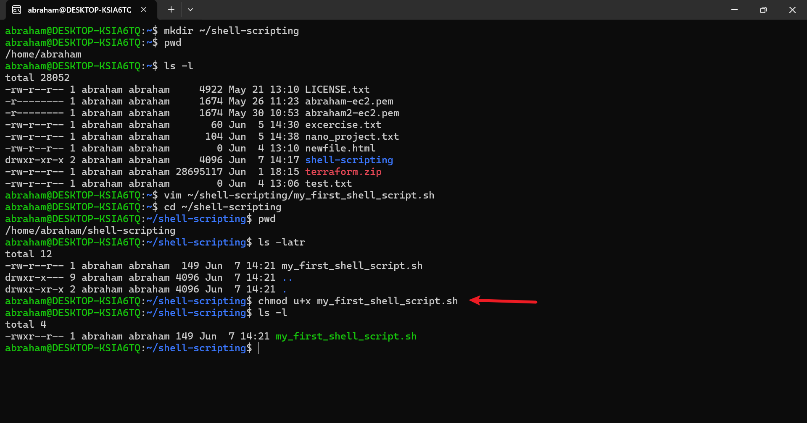

# Linux-Shell-Scripting-mini--Project
# Shell Scripting

## Project Overview
This project introduces Bash shell scripting on a local Ubuntu environment (WSL), automating directory and user creation tasks using a script.

## Setup
- Used my local Ubuntu terminal via WSL on Jun 07, 2025, 14:04 PM WAT, to practice shell scripting locally.

## Script Execution

### Creating and Editing the Script
- **Create Directory**:
  - Command: `mkdir ~/shell-scripting`
  - Purpose: Creates a `shell-scripting` directory in the home directory.
- **Create Script with Vim**:
  - Command: `vim ~/shell-scripting/my_first_shell_script.sh`
  - Purpose: Opens `my_first_shell_script.sh` for editing.
  - Syntax: Added:
    ```
    #!/bin/bash

    # Create directories
    mkdir Folder1
    mkdir Folder2
    mkdir Folder3

    # Create users
    sudo useradd user1
    sudo useradd user2
    sudo useradd user3
    ```
  - Shebang (`#!/bin/bash`): Specifies the Bash interpreter at `/bin/bash`.
- **Save and Navigate**:
  - Saved with `:wq` in Vim.
  - Navigated with: `cd ~/shell-scripting`.
- **Verify File Creation**:
  - Command: `ls -latr`
  - Purpose: `-l` for long format, `-a` for hidden files, `-t` for time sort, `-r` for reverse; confirms `my_first_shell_script.sh` exists.
  - Permissions: `-rw-r--r--` indicates read/write for owner, read for group/others (no execute).
  - **Screenshot**: File creation:

    

### Executing the Script
- **Add Execute Permission**:
  - Command: `chmod u+x my_first_shell_script.sh`
  - Purpose: `chmod` changes permissions; `u+x` adds execute for the owner.
  - Result: Permissions change to `-rwxr--r--`.
  - **Screenshot**: Permission update:

    
    
- **Run Script**:
  - Command: `./my_first_shell_script.sh`
  - Purpose: `./` executes the script in the current directory; `sudo` prompts for a password for `useradd`.
  - **Screenshot**: Script run:

    

- **Verify Folders**:
  - Command: `ls -l`
  - Purpose: Confirms `Folder1`, `Folder2`, `Folder3` are created.
  - **Screenshot**: Folders created:

    

- **Verify Users**:
  - Command: `id user1`
  - Purpose: `id` displays user details (e.g., `uid=1000(user1) gid=1000(user1) groups=1000(user1)`); note WSL may require `sudo passwd user1` for full functionality.
  - **Screenshot**: User1 created:

    

### Exploring Variables
- **Edit Script**:
  - Updated with variables:
    ```
    #!/bin/bash

    name="John"
    folders=("Folder1" "Folder2" "Folder3")
    users=("user1" "user2" "user3")

    for folder in "${folders[@]}"; do
      mkdir "$folder"
    done

    for user in "${users[@]}"; do
      sudo useradd "$user"
    done

    echo "User name: $name"
    ```
  - Purpose: Variables (`name`, `folders`, `users`) store data; loops automate tasks; `echo $name` prints the value.
- **Run and Verify**:
  - Command: `./my_first_shell_script.sh`
  - Result: Outputs “User name: John”.
  - **Screenshot**: Variable output:

    


## Tools Used
- **Ubuntu Terminal (WSL)**: For scripting and execution on Jun 07, 2025, 14:04 PM WAT.
- **Git Bash**: For submitting documentation to GitHub.
- **Vim**: For editing the shell script.
- **VS Code**: For creating this documentation.
- **GitHub**: For hosting the documentation.

## Lessons Learned
- The shebang (`#!/bin/bash`) defines the interpreter for script execution.
- `chmod u+x` is crucial for script execution permissions.
- Variables and loops enhance script automation and flexibility.

## Repository Link
[GitHub Repository](https://github.com/westgrin/Linux-Shell-Scripting-mini--Project)

## Conclusion
This project established a foundation in shell scripting, demonstrating automation of directory and user creation with Bash.